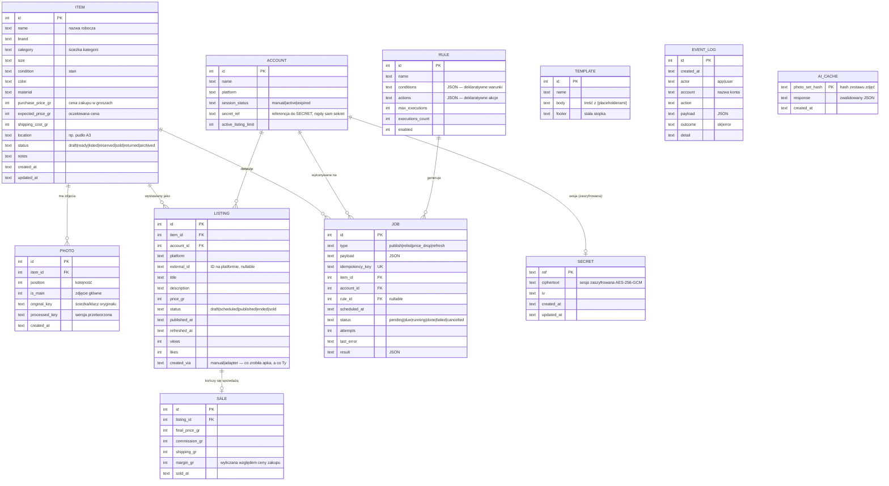

# Architektura — Menedżer Sprzedaży Vinted

> Propozycja do akceptacji. Żaden kod implementacyjny nie powstaje przed zatwierdzeniem tego dokumentu.

## 0. Decyzja kierunkowa: aplikacja webowa na Vercel

Pierwotna specyfikacja zakładała aplikację local-first (localhost, baza jako plik na dysku).
Na Twoje życzenie budujemy **stronę internetową do wdrożenia na Vercel**. To zmienia trzy rzeczy
i mówię o tym wprost:

| Założenie pierwotne | Co się zmienia w wersji webowej |
|---|---|
| Baza = jeden plik SQLite na Twoim dysku | Baza w **Turso** (SQLite w chmurze, darmowy plan). Lokalnie do developmentu nadal zwykły plik SQLite — ten sam schemat. |
| Kopia zapasowa = skopiowanie pliku | Wbudowany **eksport/dump bazy** jednym kliknięciem (plik `.sql` + CSV). |
| „Sesja Vinted nigdy nie opuszcza mojego komputera" | **Zmienione na Twoje polecenie przy akceptacji:** sesje Vinted będą przechowywane po stronie serwera — wyłącznie w postaci zaszyfrowanej (AES-256-GCM, klucz szyfrujący w zmiennej środowiskowej, nigdy w repozytorium, nigdy jawnym tekstem). Korzysta z nich dopiero `VintedAdapter` w Etapie 8; do tego czasu domyślnym trybem publikacji pozostaje tryb ręczny. |

Konsekwencja dla Etapu 8: `VintedAdapter` powstanie z pełnym pakietem bezpieczeństwa
(token bucket, backoff, wyłącznik po N błędach, idempotencja), a sesje kont będą trzymane
na serwerze w postaci zaszyfrowanej. Uczciwe ostrzeżenie, które pozostaje w mocy:
automatyzacja kont prywatnych jest niezgodna z regulaminem Vinted i realnie ryzykuje
blokadą konta — dlatego człowiek w pętli pozostaje trybem domyślnym, a adapter
automatyczny włączasz świadomie, per konto.

Bonus wersji webowej: dostęp z telefonu — zdjęcia przedmiotów robisz telefonem i wrzucasz
bezpośrednio, bez przenoszenia na komputer.

**Ponieważ strona będzie publicznie dostępna pod adresem URL, dodajemy logowanie hasłem**
(jeden użytkownik — Ty). Bez tego każdy znający adres widziałby Twój magazyn i finanse.

## 1. Stos technologiczny

| Warstwa | Wybór | Dlaczego |
|---|---|---|
| Framework | **Next.js 15 (App Router) + TypeScript strict** | Jeden framework na frontend i backend, natywnie wspierany przez Vercel. Zastępuje parę Fastify + Vite: na Vercel nie ma długo działającego serwera Node, więc Fastify nie pasuje do tego środowiska. |
| Stylowanie | **Tailwind CSS** | Zgodnie ze specyfikacją; gęsty, funkcjonalny interfejs bez pisania CSS od zera. Tryb ciemny/jasny wbudowany. |
| Baza danych | **Turso (libSQL) + Drizzle ORM + migracje** | Turso to SQLite w chmurze — zachowujemy „ducha SQLite" ze specyfikacji, Drizzle działa identycznie lokalnie (plik) i na produkcji (Turso). Darmowy plan w zupełności wystarczy na 150+ przedmiotów. |
| Zdjęcia | **Vercel Blob** + interfejs `StorageProvider` | Serverless nie ma trwałego dysku. Abstrakcja pozwala lokalnie trzymać pliki na dysku, na produkcji w Blob — reszta aplikacji nie wie, gdzie leżą zdjęcia. |
| Obróbka zdjęć | **sharp** | Standard w Node: skalowanie, korekta orientacji EXIF i **usunięcie wszystkich metadanych (w tym GPS) zanim plik zostanie zapisany** — surowy plik z geolokalizacją nigdy nie trafia do magazynu. |
| Walidacja | **Zod** | Jeden mechanizm walidacji: formularze, API, odpowiedzi AI. |
| AI | interfejs **`VisionProvider`** | Dostawca (Anthropic/OpenAI) zostanie wybrany przed Etapem 3 — architektura jest na to gotowa, klucz API tylko w zmiennej środowiskowej. |
| Harmonogram | **Zadania w bazie + „tick" bez procesu w tle** | Patrz sekcja 5 — kluczowa zmiana względem pętli `node-cron`. |
| Logowanie | **iron-session** (cookie) + hasło z env | Najprostsze poprawne rozwiązanie dla jednego użytkownika. Bez NextAuth — to byłby przerost formy. |
| Testy | **Vitest** | Logika domenowa (`src/domain`) pokryta testami; adaptery mockowane. |

## 2. Struktura katalogów

```
vinted-manager/
├── README.md               # instrukcja krok po kroku (od instalacji Node.js)
├── .env.example            # wzór zmiennych środowiskowych, bez sekretów
├── drizzle/                # wygenerowane migracje SQL
└── src/
    ├── app/                # ekrany (Next.js App Router) + API
    │   ├── login/          # logowanie hasłem
    │   ├── dashboard/      # 1. Dashboard
    │   ├── magazyn/        # 2. Magazyn (siatka + tabela)
    │   ├── dodaj/          # 3. Kreator: zdjęcia → AI → edycja → zapis
    │   ├── kolejka/        # 4. Kalendarz zadań
    │   ├── reguly/         # 5. Reguły relistingu + podgląd na sucho
    │   ├── konta/          # 6. Konta
    │   ├── historia/       # 7. Przeglądarka EventLog
    │   ├── ustawienia/     # 8. Limity, klucze, szablony
    │   └── api/            # endpointy: upload, ai, cron/tick, export
    ├── components/         # współdzielone komponenty UI
    ├── db/                 # schemat Drizzle, klient bazy
    ├── domain/             # CZYSTA logika biznesowa — bez importów z Next/DB
    │   ├── rules/          #   silnik reguł relistingu (dane, nie kod)
    │   ├── scheduling/     #   generowanie planu publikacji z ustawień
    │   └── finance/        #   marże, prowizje, statystyki
    ├── adapters/           # MarketplaceAdapter + implementacje
    │   ├── manual/         #   ManualAdapter (domyślny, zero sieci)
    │   ├── dry-run/        #   DryRunAdapter (tylko logi)
    │   └── vinted/         #   VintedAdapter (Etap 8, zaprojektowany, wyłączony)
    ├── ai/                 # VisionProvider, prompt, schemat Zod, cache
    ├── storage/            # StorageProvider: dysk lokalny / Vercel Blob
    └── lib/                # auth, konfiguracja, utils
```

Zasada: `src/domain` nie importuje niczego z Next.js ani z bazy — dzięki temu silnik reguł,
planowanie i finanse testujemy Vitestem bez uruchamiania aplikacji.

## 3. Model danych (ERD)



Uwagi projektowe:

- **Ceny w groszach (integer)** — nigdy float, żeby uniknąć błędów zaokrągleń w marżach.
- **`SECRET` przechowuje wyłącznie szyfrogram** (AES-256-GCM); klucz szyfrujący żyje w zmiennej
  środowiskowej serwera, więc sam zrzut bazy nie ujawnia sesji. Celowo bez klucza obcego —
  usunięcie sekretu (wylogowanie konta) nie może kaskadowo ruszyć danych konta.
- **`EVENT_LOG` bez kluczy obcych** — celowo: dziennik jest niezmienialny i ma przetrwać
  nawet usunięcie przedmiotu czy konta, których dotyczył.
- **`JOB.idempotency_key` unikalny** — ponowienie zadania po awarii nie utworzy duplikatu.
- **`LISTING.created_via`** — jawne rozróżnienie: co zrobiła aplikacja, a co Ty ręcznie.
- **`RULE.conditions/actions` jako JSON w bazie** — silnik reguł to dane, nie kod. Format:
  `{"all": [{"field": "days_listed", "op": ">", "value": 7}, {"field": "status", "op": "=", "value": "listed"}]}`
  → `{"type": "price_drop", "percent": 10, "min_price_gr": 2000}`.

### Indeksy i uzasadnienia

| Indeks | Po co |
|---|---|
| `items(status)` | Każdy widok magazynu filtruje po statusie. |
| `items(created_at)` | Widok „leżące najdłużej" sortuje po wieku w magazynie. |
| `photos(item_id, position)` | Pobranie galerii przedmiotu w kolejności — jedno zapytanie po indeksie. |
| `listings(item_id)` | Karta przedmiotu pokazuje wszystkie jego wystawienia. |
| `listings(account_id, status)` | Liczenie aktywnych ogłoszeń per konto (pilnowanie limitów). |
| `jobs(status, scheduled_at)` | Główne zapytanie „ticka": `status='pending' AND scheduled_at <= teraz`. |
| `jobs(idempotency_key)` UNIQUE | Gwarancja braku duplikatów przy ponowieniach. |
| `event_log(created_at)` | Historia przeglądana od najnowszych. |
| `event_log(account, created_at)` | Filtr historii po koncie. |
| `sales(sold_at)` | Miesięczne podsumowania finansowe. |
| `ai_cache(photo_set_hash)` PK | Wyszukanie w cache przed wywołaniem (płatnego) AI. |

Nie indeksujemy marki/kategorii/rozmiaru — przy skali setek do kilku tysięcy rekordów
SQLite przefiltruje to w milisekundy bez indeksu; indeksy dodamy, gdy dane pokażą, że są potrzebne.

## 4. Przepływ danych (ścieżka główna)

```
zdjęcia (drag&drop / telefon)
  → sharp: orientacja EXIF, skalowanie, USUNIĘCIE metadanych (w tym GPS)
  → zapis do StorageProvider (Blob / dysk)          ← surowy plik z GPS nigdy nie jest zapisywany
  → Item (status: draft)
  → [Etap 3] VisionProvider → JSON → walidacja Zod → cache po hashu zdjęć
  → formularz edycji (brand_confidence=low → pole wymaga potwierdzenia; flags → widoczne ostrzeżenia)
  → Twoja akceptacja → Item: ready
  → harmonogram → Job (pending, z timestampem i kluczem idempotencji)
  → tick: Job staje się "due" → trafia na listę „Do zrobienia dziś"
  → ManualAdapter: paczka (tytuł+opis do skopiowania, zdjęcia do pobrania, checklista pól)
  → TY wklejasz do Vinted i klikasz „opublikowane"
  → Listing (published, created_via=manual) + wpis w EventLog
```

## 5. Harmonogram bez procesu w tle (decyzja architektoniczna)

Vercel to środowisko serverless — nie ma tam wiecznie działającej pętli `node-cron`.
Zamiast tego:

1. **Zadania żyją w bazie** (`JOB` z timestampami) — jak w specyfikacji.
2. **„Tick"** to czysta, idempotentna funkcja: „które zadania pending mają `scheduled_at` w przeszłości?
   Oznacz je jako due". Wywoływana przy każdym otwarciu aplikacji oraz raz dziennie przez Vercel Cron
   (materializacja zadań z reguł relistingu, przeliczenie sugestii).
3. Ponieważ publikacja i tak wymaga Ciebie (human-in-the-loop), zadanie „odpala się" przez
   **pojawienie się na liście „Do zrobienia"**, gdy otworzysz aplikację — nic nie wykonuje się bez Ciebie.

Efekt uboczny, który jest zaletą: odporność na restarty jest trywialna — nie ma procesu,
który mógłby umrzeć z niewykonanymi zadaniami w pamięci. Cały stan jest w bazie, tick jest
idempotentny, a przerwanie w dowolnym momencie niczego nie psuje (spełnia kryterium spójności).

## 6. Warstwa integracji

Interfejs `MarketplaceAdapter`: `publish`, `update`, `delete`, `fetchListings`, `fetchStats`, `sendMessage`.

| Adapter | Zachowanie | Kiedy |
|---|---|---|
| `ManualAdapter` | **Domyślny.** Zero żądań sieciowych. Generuje paczkę: tekst do skopiowania, zdjęcia, checklistę. | Etap 4 |
| `DryRunAdapter` | Loguje do EventLog, co zostałoby wysłane. Do testów schedulera i reguł. | Etap 4 |
| `VintedAdapter` | Realna implementacja: token bucket, backoff z jitterem, wyłącznik bezpieczeństwa po N błędach, idempotencja, pełny EventLog. Sesje kont przechowywane na serwerze **wyłącznie zaszyfrowane** (AES-256-GCM). Włączany świadomie per konto; domyślnie wyłączony, bo automatyzacja kont prywatnych łamie regulamin Vinted i ryzykuje blokadą. | Etap 8 |

## 7. Etapy prac (bez zmian w kolejności, dostosowane do weba)

1. **Fundament** — szkielet Next.js, schemat bazy + migracje, logowanie hasłem, jeden działający ekran (Magazyn — pusty stan), README od „zainstaluj Node.js" po „wdróż na Vercel".
2. **Magazyn** — CRUD przedmiotów, upload zdjęć z czyszczeniem EXIF, filtry, siatka/tabela, widok „leżą najdłużej".
3. **Generowanie AI** — wybór dostawcy, VisionProvider, walidacja Zod, cache, formularz edycji.
4. **ManualAdapter + DryRunAdapter** — pełny przepływ do paczki ręcznej. Od tego etapu aplikacja ma realną wartość.
5. **Scheduler i kolejka** — ustawienia harmonogramu, generowanie zadań, kalendarz, tick.
6. **Silnik reguł** — edytor, podgląd na sucho, limity wykonań.
7. **Statystyki i eksporty** — dashboard finansowy, CSV, podsumowanie miesięczne, eksport bazy.
8. **VintedAdapter** — projekt + DryRun; realna publikacja tylko oficjalną ścieżką.

Po każdym etapie: commit, push, prezentacja efektu i **stop do Twojej akceptacji**.

## 8. Kryteria akceptacji — co się zmienia względem specyfikacji

| Kryterium | Status |
|---|---|
| `npm install && npm run dev` działa na czystej maszynie | Bez zmian (lokalnie: SQLite w pliku). |
| TypeScript strict, zero `any` bez komentarza | Bez zmian. |
| Logika domenowa w testach, adaptery mockowane | Bez zmian. |
| Zero sekretów w repo, jest `.env.example` | Bez zmian. |
| Działa offline poza AI i publikacją | **Zmiana:** wersja produkcyjna jest stroną WWW — wymaga internetu. Wersja lokalna (`npm run dev`) działa offline. |
| Backup = kopiowanie jednego pliku | **Zmiana:** przycisk eksportu bazy (.sql + CSV) w Ustawieniach. |
| Każda operacja na platformie w EventLog | Bez zmian. |
| Zatrzymanie w dowolnym momencie nie psuje bazy | Bez zmian (transakcje + idempotentny tick). |
